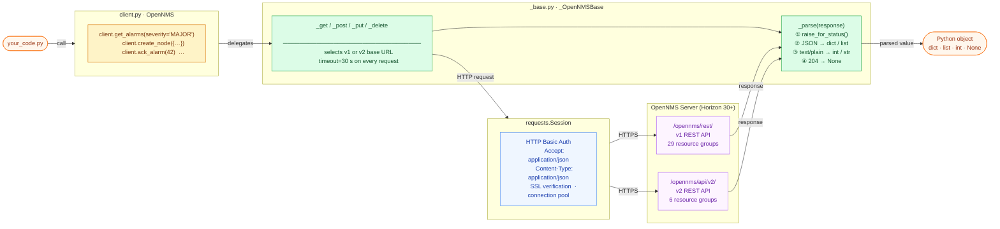

# Architecture Diagrams — opennms-api-wrapper

## Package composition

`OpenNMS` (in `client.py`) is built by multiple-inheriting from `_OpenNMSBase`
and 30 mixin classes — one per API resource group.  Dashed arrows represent
mixin inheritance; the solid arrow represents the base-class relationship.

```mermaid
flowchart TD
    caller(["Your Code"])

    subgraph fault_sg["Fault Management"]
        AlarmsMixin
        AlarmStatsMixin
        AlarmHistoryMixin
    end

    subgraph events_sg["Events & Notifications"]
        EventsMixin
        NotificationsMixin
        AcksMixin
    end

    subgraph inventory_sg["Network Inventory"]
        NodesMixin
        OutagesMixin
    end

    subgraph provision_sg["Provisioning"]
        RequisitionsMixin
        ForeignSourcesMixin
        SnmpConfigMixin
    end

    subgraph admin_sg["Administration"]
        GroupsMixin
        UsersMixin
        CategoriesMixin
        SchedOutagesMixin
        KscReportsMixin
    end

    subgraph data_sg["Data & Reporting"]
        ResourcesMixin
        MeasurementsMixin
        HeatmapMixin
        FlowsMixin
        DeviceConfigMixin
    end

    subgraph viz_sg["Visualization"]
        MapsMixin
        GraphsMixin
    end

    subgraph v2_sg["v2-only Resources"]
        SituationsMixin
        BusinessServicesMixin
        MetadataMixin
        DiscoveryMixin
        IpInterfacesV2Mixin
        SnmpInterfacesV2Mixin
    end

    InfoMixin["InfoMixin"]

    _OpenNMSBase["_OpenNMSBase  ·  _base.py
    ─────────────────────────────
    _get / _post / _put / _delete
    _parse  ·  _url"]

    subgraph client_sg["client.py"]
        OpenNMS["OpenNMS
        ─────────────────────────────
        252 public methods · flat namespace"]
    end

    caller       -->|"client.method()"|  OpenNMS

    fault_sg     -.->|"mixin"| OpenNMS
    events_sg    -.->|"mixin"| OpenNMS
    inventory_sg -.->|"mixin"| OpenNMS
    provision_sg -.->|"mixin"| OpenNMS
    admin_sg     -.->|"mixin"| OpenNMS
    data_sg      -.->|"mixin"| OpenNMS
    viz_sg       -.->|"mixin"| OpenNMS
    v2_sg        -.->|"mixin"| OpenNMS
    InfoMixin    -.->|"mixin"| OpenNMS

    _OpenNMSBase -->|"base class"| OpenNMS

    classDef mixin  fill:#dbeafe,stroke:#3b82f6,color:#1e3a5f
    classDef core   fill:#fef3c7,stroke:#d97706,color:#78350f,font-weight:bold
    classDef base   fill:#dcfce7,stroke:#16a34a,color:#14532d
    classDef caller fill:#f1f5f9,stroke:#94a3b8,color:#334155

    class AlarmsMixin,AlarmStatsMixin,AlarmHistoryMixin mixin
    class EventsMixin,NotificationsMixin,AcksMixin mixin
    class NodesMixin,OutagesMixin mixin
    class RequisitionsMixin,ForeignSourcesMixin,SnmpConfigMixin mixin
    class GroupsMixin,UsersMixin,CategoriesMixin,SchedOutagesMixin,KscReportsMixin mixin
    class ResourcesMixin,MeasurementsMixin,HeatmapMixin,FlowsMixin,DeviceConfigMixin mixin
    class MapsMixin,GraphsMixin mixin
    class SituationsMixin,BusinessServicesMixin,MetadataMixin,DiscoveryMixin,IpInterfacesV2Mixin,SnmpInterfacesV2Mixin mixin
    class InfoMixin mixin
    class OpenNMS core
    class _OpenNMSBase base
    class caller caller
```

---

## Request lifecycle

What happens at runtime when any method on the client is called.



---

*See [ARCHITECTURE.md](ARCHITECTURE.md) for the decision record behind each design choice.*
